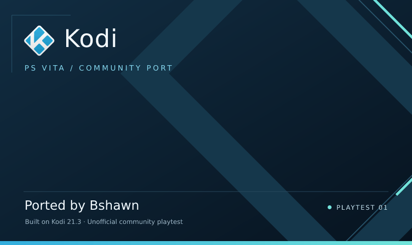

# Kodi Vita

Kodi 21.3 for PS Vita and PlayStation TV. Ported by **Bshawn**.

This is an early playtest build. Local video, Real-Debrid playback and live TV have worked on hardware. There are still rough edges, and I could use more people trying it on their own setups.

## Downloads

[Download Playtest 01](https://github.com/ItsJustBshawn/kodi-vita/releases/tag/playtest-01).

Choose the **VPK** for a normal install, or the **folder-install ZIP** if VPK installation is too slow. The **source ZIP** is for building or reviewing the port. You do not need it to run Kodi.

## Getting started

You need a homebrew-enabled Vita or PlayStation TV, VitaShell, and the `libshacccg.suprx` shader compiler. If you do not have the compiler, [ShaRKBR33D](https://github.com/Rinnegatamante/ShaRKBR33D) can set it up. It is not included with Kodi.

Vita Streams is included. That handles Real-Debrid and M3U/HLS streams, so you do not need another video player or streaming app.

## Installation

### VPK

Copy the VPK to `ux0:data/`, open it in VitaShell and install it. Launch Kodi Vita from the home screen.

The VPK has a lot of files, so installation can take a while. If that is a problem, use the folder package.

### Folder install

1. Extract the folder-install ZIP on your computer.
2. Copy `Kodi-Vita-Playtest-01` into `ux0:data/` on the Vita. USB is preferable when available. FTP also works.
3. Wait for the transfer to finish. In VitaShell, highlight the folder and choose **Triangle > More > Install folder**.
4. Launch Kodi Vita.

This skips archive extraction on the Vita. The VPK and folder package contain the same application. The folder normally disappears after installation.

Keep Kodi closed while installing an update. For a completely fresh setup, delete the old Kodi bubble and remove `ux0:data/kodi/` before reinstalling. That folder contains your settings, history and saved sign-in, so only remove it if you want to reset those.

## Try it without an account

Open **Favourites > Al Jazeera English**. There is also a free live test at the top of the Vita Streams menu.

This is a public 360p stream. Give it around 20 seconds to start. Check that you get moving video and sound, then try stopping and opening it again. The broadcaster can change or remove the stream.

## Real-Debrid

Open **Add-ons > Video add-ons > Vita Streams > Sign in to Real-Debrid**. Follow the code instructions on your phone or computer, then use **My Real-Debrid downloads** or **Play a Real-Debrid link**.

You need your own account. No account, token or private playlist is included in these downloads. Vita Streams plays links and downloads from your account; it does not search for movies or shows.

For a free test film, [Sintel is available through WebTorrent](https://webtorrent.io/free-torrents). Add its torrent through Real-Debrid's website, let it finish and generate the MP4 download link there. Then reopen your downloads in Vita Streams. The H.264/AAC version at 1024x436 worked in testing.

Account playback and token refresh have passed on hardware after pairing through the computer. The sign-in screen on the Vita still needs more testing with fresh accounts.

## Controls

D-pad or left stick to move, Cross to select, Circle to go back, and Triangle for the context menu.

Start pauses or resumes playback. Square stops it. Select switches fullscreen. L and R move through pages. Use the on-screen playback controls to seek.

Touch controls are not implemented.

## What has been tested

Local MP4 and MKV video, WAV, FLAC, MP3, M4A and OGG audio, Big Buck Bunny, Sintel through Real-Debrid, and Al Jazeera live TV have been tested on hardware.

The latest account test had picture and sound for Sintel and Al Jazeera. Pause, resume, seeking, stopping, reopening, token refresh and a clean exit also passed. Seeking can take a few seconds.

That does not cover every file or every Kodi feature. Longer sessions, suspend and resume, Wi-Fi interruptions, and the new package's clean installation still need wider testing.

## Known limits

Live TV currently means M3U playlists and HLS streams. EPG, recording, DRM and binary PVR or input-stream add-ons are not supported by this integration.

Some codecs and higher resolutions may fail. Start with H.264/AAC and a lower resolution when possible. Third-party Kodi add-ons are not guaranteed to work.

There is also an unresolved FFmpeg MOV issue found by a host sanitizer check. The native M4A test passed, but that finding still needs investigation.

## Reporting a problem

Please include your device model, build version, what you were playing, and the steps that caused the problem. Say whether you got sound, video, an error message or a crash. A short video of the problem helps.

Kodi logs are under `ux0:data/kodi/temp/`. Check them before posting because they can contain private playback links. Do not upload `auth.json`, account tokens or your whole Kodi data folder.

## Source and credits

The [source archive](https://github.com/ItsJustBshawn/kodi-vita/releases/download/playtest-01/kodi-vita-bshawn-playtest-01-source.zip) includes the port, build instructions, patches and dependency sources. Build notes are in `docs/README.Vita.md` inside the Kodi source tree.

Kodi is made by the Kodi team and its contributors. This is an unofficial community port. Thanks to the VitaSDK, vitaGL, CPython-Vita and FFmpeg projects, and to everyone helping test it.

Original licenses and copyright notices are included with the downloads. Ported by **Bshawn**.
